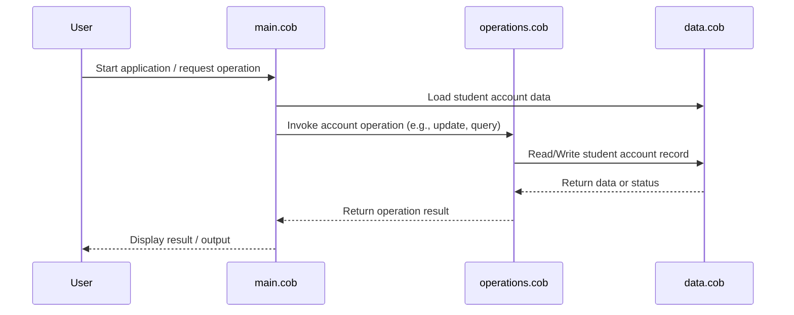

# COBOL Source Documentation

This project contains legacy COBOL code for managing student accounts. Below is an overview of each COBOL file, their key functions, and business rules related to student accounts.

## File Overview

### `data.cob`
- **Purpose:**
  - Defines the data structures and records used throughout the application.
  - Contains student account record layouts, field definitions, and constants.
- **Key Functions:**
  - Declares student account fields such as student ID, name, balance, and status.
  - Provides shared data definitions for use by other COBOL modules.
- **Business Rules:**
  - Ensures all student account records conform to a standard structure for consistency and data integrity.

### `main.cob`
- **Purpose:**
  - Serves as the main entry point for the COBOL application.
  - Orchestrates the overall flow of the student account management process.
- **Key Functions:**
  - Initializes the application and loads required data.
  - Calls processing routines for student account operations.
  - Handles user input and output.
- **Business Rules:**
  - Validates user actions against business rules before processing.
  - Ensures only authorized operations are performed on student accounts.

### `operations.cob`
- **Purpose:**
  - Implements the core business logic for student account operations.
  - Contains procedures for updating, querying, and maintaining student accounts.
- **Key Functions:**
  - Processes account updates such as deposits, withdrawals, and status changes.
  - Performs validation checks on account transactions.
  - Generates reports or summaries as needed.
- **Business Rules:**
  - Enforces rules such as minimum balance requirements, valid account statuses, and transaction limits.
  - Ensures all updates are logged and auditable.

## Business Rules Summary
- Student accounts must have unique IDs and valid statuses.
- Transactions are validated for correctness and compliance with business policies.
- All changes to student accounts are tracked for audit purposes.

---

For further details, refer to the source code in the `src/cobol/` directory.

---

## Sequence Diagram: Student Account Data Flow

